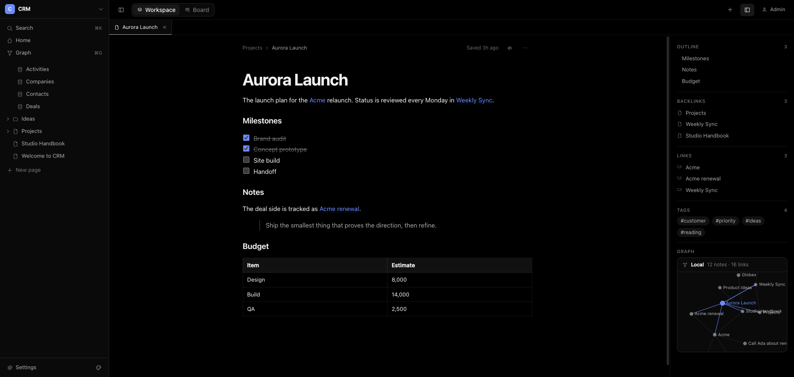
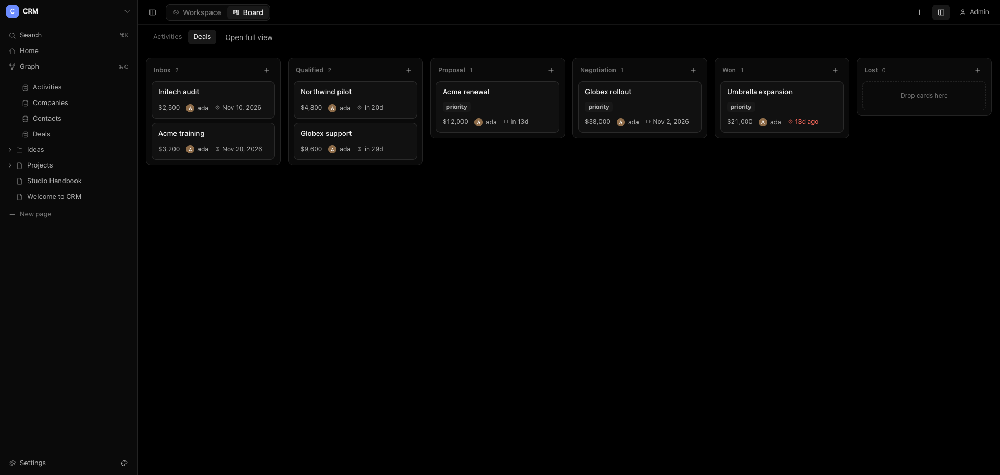
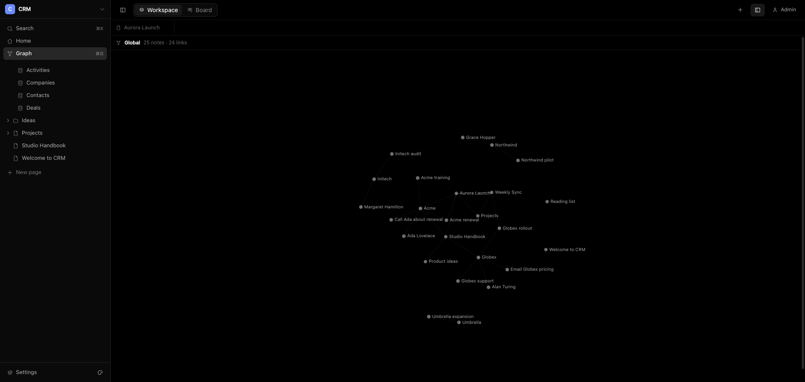
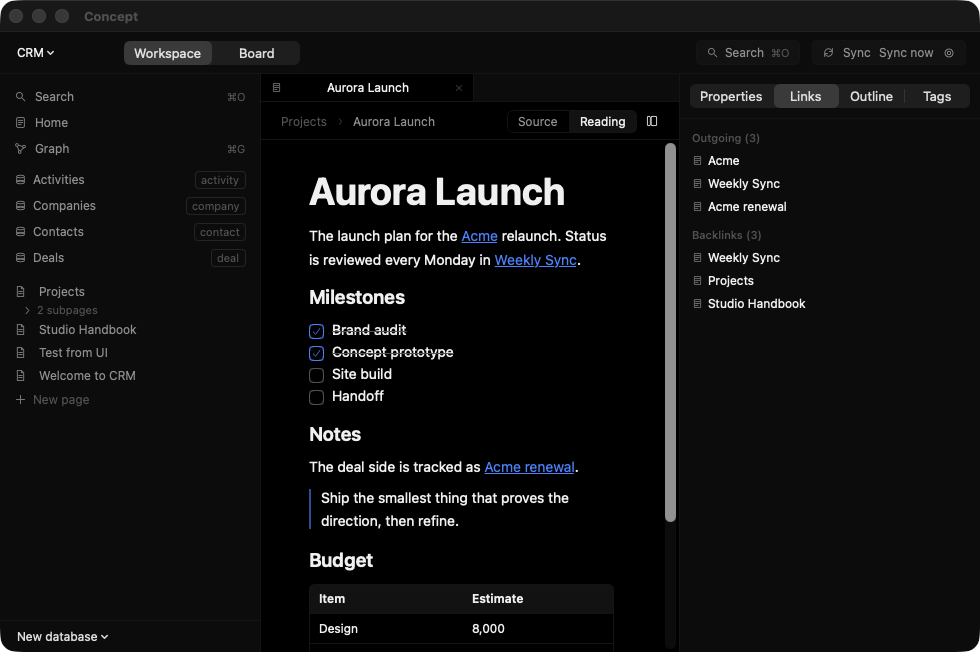

<h1 align="center">Concept</h1>

<p align="center">
  Pages, databases and boards for your team, stored as plain Markdown.<br>
  Self-host it, or use the native Mac app on a local folder. Sync with Git.
</p>

<p align="center">
  
</p>

## What it is

Concept combines the parts of Notion, Trello and Obsidian that people actually use, and keeps all of it in a folder of Markdown files you own.

- **Workspace.** One sidebar that is your folder. Every file opens as a page with a title, a properties block and a block editor. `[[Wiki links]]` are real links. A side panel shows the outline, backlinks, outgoing links, tags and a local graph; the full graph is one shortcut away.
- **Board.** Any database becomes a board. Drag cards between columns, open a card for its checklist, comments and activity. A card is a file, so it also appears in the workspace, the graph and backlinks.
- **A CRM when you want one.** Start a workspace from the CRM template for Companies, Contacts, Deals and Activities, with a home page that shows pipeline value and what is due.
- **Teams.** Roles (owner, admin, member, guest), teams, invite links and per-folder permissions.
- **Git sync.** Edits are committed as the person who made them and pushed to your remote. Conflicts never lose data: the losing side is saved next to the original.
- **Works with [Retex](https://github.com/michael-berardi/retex).** The vault is a valid Retex vault. Cards you move with `retex move` show up in Concept within a moment, and the other way round.
- **Six themes.** OLED black by default, plus Graphite, Paper, Snow, Midnight and Forest.

<p align="center">
  
  
</p>

<p align="center">
  
</p>

## Run the server

```sh
git clone https://github.com/michael-berardi/concept.git
cd concept
CONCEPT_SECRET=$(openssl rand -base64 32) docker compose up -d
```

Open <http://localhost:8787>. The first account you create becomes the admin and gets a CRM workspace. Everything lives in the `concept-data` volume. To run without Docker (Node 22.5+ and git), see [docs/SELF-HOSTING.md](docs/SELF-HOSTING.md).

## Use the Mac app

Build it with `macos/scripts/bundle.sh`, or download `Concept-<version>.zip` from [Releases](https://github.com/michael-berardi/concept/releases). The app is signed ad hoc, so macOS asks you to confirm the first launch: right-click the app and choose Open.

Open any folder of Markdown, or create a vault from a template. It watches the folder, so edits from Retex, Obsidian or Git appear straight away.

## Your data

```
<vault>/
  Pages/            pages, nested by folder
  Data/<database>/  one Markdown file per row or card
  Attachments/
  .concept/         workspace and database schemas (plain JSON)
```

Every file is Markdown with YAML frontmatter (`title`, `status`, `rank`, `owner`, `company`, `value`, `due`, `tags` and any property you add). Nothing is locked in: `git`, Retex, Obsidian and VS Code all work on the same folder. See [docs/SPEC.md](docs/SPEC.md) for the format and [docs/API.md](docs/API.md) for the REST API.

## Repository

| Folder | What it is |
| --- | --- |
| `server/` | Node 22 + TypeScript + Hono, SQLite index, REST and live updates |
| `web/` | React 19 + Vite web app, built into `server/public` |
| `macos/` | Swift package: `ConceptKit` (vault engine) and the SwiftUI app |
| `docs/` | Spec, API, self-hosting |

Run the tests: `pnpm -r test` (server, web) and `cd macos && swift test`.

## License

MIT
